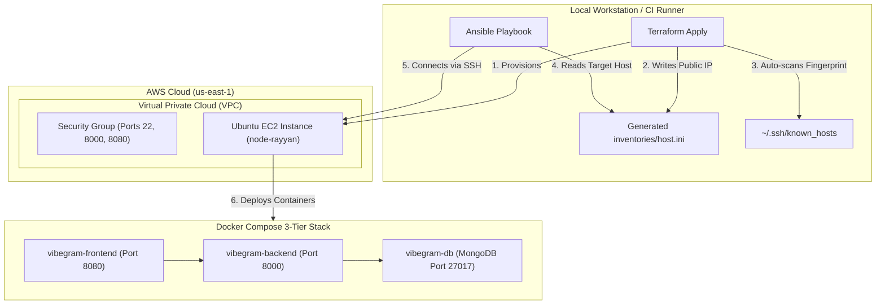

# 🚀 Automated Cloud Infrastructure & 3-Tier Application Deployment

[](https://www.terraform.io/)
[](https://www.ansible.com/)
[](https://aws.amazon.com/ec2/)
[](https://docs.docker.com/compose/)
[](https://ubuntu.com/)
[](https://opensource.org/licenses/MIT)

An end-to-end DevOps automation pipeline combining **Infrastructure as Code (IaC)** using **Terraform** and **Configuration Management** with **Ansible** to automatically provision AWS infrastructure, establish secure SSH trust, install Docker runtime environments, and deploy the full-stack 3-tier **[VibeGram](https://github.com/rayyankhan-devops/vibegram)** application (React + FastAPI + MongoDB).

---

## 📐 Architecture & Workflow



---

## ✨ Key Engineering Highlights

- **Dynamic Inventory Pipeline**: Automatically writes the provisioned EC2 public IP into `ansible/inventories/host.ini` using Terraform's `local_file` resource immediately after instance creation.
- **Zero-Touch SSH Trust**: Implements a Terraform `local-exec` provisioner with polling and `ssh-keyscan` that waits for EC2 port 22 and automatically registers the host fingerprint into `~/.ssh/known_hosts`, eliminating manual `yes/no` prompts.
- **Kernel-Level Workaround for MongoDB 8.0**: Dynamically generates a `docker-compose.override.yml` during Ansible deployment injecting `GLIBC_TUNABLES=glibc.pthread.rseq=1`. This resolves the known incompatibility between MongoDB 8.0's TCMalloc allocator and Linux kernel versions 6.19–7.0.13 (Ubuntu 24.10) without modifying upstream repository code ([SERVER-121912](https://jira.mongodb.org/browse/SERVER-121912)).
- **Resilient Apt Package Management**: Built-in exponential backoff retries in Ansible handle `dpkg/lock-frontend` race conditions caused by fresh EC2 `unattended-upgrades`.
- **Modular Terraform Codebase**: Separates root orchestration, variables, outputs, and reusable child modules (`modules/ec2`).

---

## 📁 Repository Structure

```text
.
├── .gitignore                          # Strict rules ignoring state, keys, and live IP inventory
├── README.md                           # Documentation & quickstart guide
├── ansible/
│   ├── ansible.cfg                     # Ansible defaults (inventory path, host key checking)
│   ├── inventories/
│   │   ├── host.ini.example            # Reference inventory template
│   │   └── host.ini                    # Dynamic inventory (auto-generated by Terraform)
│   └── playbook/
│       └── run-app.yml                 # Playbook installing Docker & deploying VibeGram
└── terraform/
    ├── main.tf                         # Module calls, inventory generator & known_hosts automation
    ├── output.tf                       # Root public outputs
    ├── terraform.tf                    # Terraform versions, providers (AWS & Local)
    ├── .terraform.lock.hcl             # Dependency lockfile
    └── modules/
        └── ec2/
            ├── main.tf                 # aws_instance resource definition
            ├── variable.tf             # Subnet, AMI, key pair, instance type variables
            └── output.tf               # Module public IP output
```

---

## 🛠️ Prerequisites

Before getting started, ensure you have the following installed and configured:

1. **AWS CLI** configured with appropriate permissions:
   ```bash
   aws configure
   ```
2. **Terraform**: `>= 1.5.0`
3. **Ansible**: `>= 2.14`
4. **AWS Key Pair**: An existing SSH key pair created in AWS (e.g. `aws-prac-key`) with the private `.pem` file saved locally at `~/.ssh/aws-prac-key.pem` (`chmod 400 ~/.ssh/aws-prac-key.pem`).

---

## 🚀 Quickstart & Deployment Guide

### Step 1: Clone the Repository
```bash
git clone <your-repo-url>
cd terraform-ansible
```

### Step 2: Configure Terraform Variables (Optional)
If you wish to customize instance settings (VPC, Subnet, AMI, Instance Type), edit [terraform/modules/ec2/variable.tf](terraform/modules/ec2/variable.tf):
```hcl
variable "instance_type" {
  default = "t3.micro"
}

variable "key_name" {
  default = "aws-prac-key"
}
```

### Step 3: Provision AWS Infrastructure with Terraform
```bash
cd terraform

# Initialize providers
terraform init

# Review and provision resources
terraform apply -auto-approve
```

**What happens automatically:**
1. Provisions the AWS EC2 instance in `us-east-1`.
2. Automatically generates `../ansible/inventories/host.ini` with the live public IP.
3. Waits for the instance to boot and automatically registers its SSH key to `~/.ssh/known_hosts`.

### Step 4: Deploy the Application with Ansible
```bash
cd ../ansible

# Execute the playbook
ansible-playbook playbook/run-app.yml
```

**Tasks executed by Ansible:**
1. Updates package cache with retry resilience.
2. Installs `git`, `docker.io`, and `docker-compose-v2`.
3. Enables and starts the Docker daemon service.
4. Adds the `ubuntu` user to the `docker` group.
5. Clones [VibeGram](https://github.com/rayyankhan-devops/vibegram.git) into `/home/ubuntu/vibegram`.
6. Copies `.env.example` to `.env`.
7. Applies the MongoDB `GLIBC_TUNABLES` compatibility override.
8. Launches the multi-container stack via `docker compose up -d --build`.
9. Verifies container health and displays running services.

---

## 🌐 Application Verification

Once Ansible finishes, access your application using the EC2 public IP:

| Service | URL | Description |
| :--- | :--- | :--- |
| **Frontend Web App** | `http://<EC2_PUBLIC_IP>:8080` | React 18 + Vite social feed interface |
| **Backend API Docs** | `http://<EC2_PUBLIC_IP>:8000/docs` | Interactive Swagger API documentation |
| **Backend Health Check** | `http://<EC2_PUBLIC_IP>:8000/health` | Live system and database connectivity status |

### Demo Accounts for Testing
- **Usernames:** `@alex_design`, `@sarah_codes`, `@mike_lens`, `@elena_wander`, `@david_beats`
- **Password:** `password123`

---

## 🧹 Teardown & Resource Cleanup

To avoid unexpected AWS charges, destroy the infrastructure when finished:

```bash
cd terraform
terraform destroy -auto-approve
```

---

## 🔒 Security Best Practices

- **Zero Secrets in Source Control**: All `.pem` private keys, Terraform state files (`.tfstate`), and live IP inventories are excluded via [.gitignore](.gitignore).
- **Principle of Least Privilege**: Playbook sets proper directory ownership (`ubuntu:ubuntu`) and configures non-root Docker group execution.
- **Automated Host Verification**: Uses `StrictHostKeyChecking=accept-new` to prevent man-in-the-middle attacks while ensuring headless automation.

---

## 📄 License
This project is open-source and available under the [MIT License](LICENSE).
